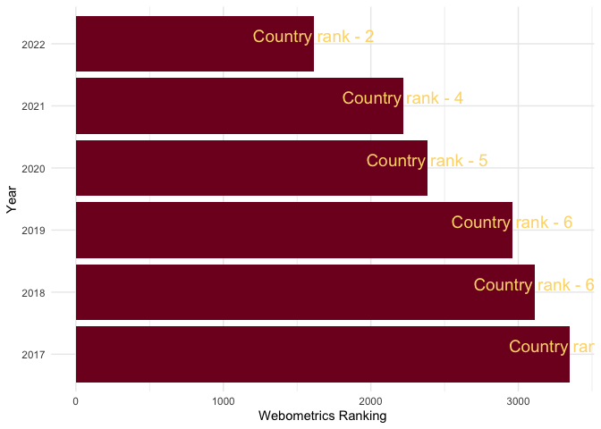
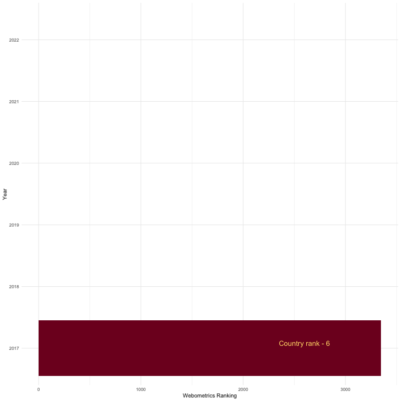

``` r
library(tidyverse)
```

    ## ── Attaching packages ─────────────────────────────────────── tidyverse 1.3.1 ──

    ## ✔ ggplot2 3.3.6.9000     ✔ purrr   0.3.4     
    ## ✔ tibble  3.1.7          ✔ dplyr   1.0.9     
    ## ✔ tidyr   1.2.0          ✔ stringr 1.4.0     
    ## ✔ readr   2.1.2          ✔ forcats 0.5.1

    ## ── Conflicts ────────────────────────────────────────── tidyverse_conflicts() ──
    ## ✖ dplyr::filter() masks stats::filter()
    ## ✖ dplyr::lag()    masks stats::lag()

``` r
Year <- factor(2017:2022)
World <- c(3349, 3109, 2960, 2383, 2219, 1614)
Country <- c(6, 6, 6, 5, 4, 2)
clabel <- c("Country rank - 6",
           "Country rank - 6",
           "Country rank - 6",
           "Country rank - 5",
           "Country rank - 4",
           "Country rank - 2")

df <- data.frame(Year, World, Country,  clabel)
df
```

    ##   Year World Country           clabel
    ## 1 2017  3349       6 Country rank - 6
    ## 2 2018  3109       6 Country rank - 6
    ## 3 2019  2960       6 Country rank - 6
    ## 4 2020  2383       5 Country rank - 5
    ## 5 2021  2219       4 Country rank - 4
    ## 6 2022  1614       2 Country rank - 2

``` r
library(ggplot2)
library(gganimate)
ggplot(df, aes(x = Year, y = World)) +  # Plot with values on top
  geom_bar(stat = "identity", fill= "#800026") + coord_flip() +
  geom_text(aes(label = clabel), size=5,
            vjust = -0.2, colour = "#fed976") +
  scale_x_discrete(labels = Year) + 
  theme_minimal() + 
  ylab("Webometrics Ranking")  
```

<!-- -->

``` r
ggplot(df, aes(x = Year, y = World)) +  # Plot with values on top
  geom_bar(stat = "identity", fill= "#800026") + coord_flip() +
  geom_text(aes(label = clabel), size=5,
            vjust = -0.2, colour = "#fed976") +
  scale_x_discrete(labels = Year) + 
  theme_minimal() + 
  ylab("Webometrics Ranking")  
```

<!-- -->

``` r
plot2 <- ggplot(df, aes(x = Year, y = World)) +  # Plot with values on top
  geom_bar(stat = "identity", fill= "#800026") + coord_flip() +
  geom_text(aes(label = clabel), size=5, hjust = 2,
            vjust = -0.5, colour = "#fed976") +
  scale_x_discrete(labels = Year) + 
  theme_minimal() + 
  ylab("Webometrics Ranking") + 
  transition_time(as.integer(Year)) +
  shadow_mark() +
  enter_grow() +
  enter_fade()

mygif <- animate(plot2, width=800, height=800, renderer=gifski_renderer(loop=FALSE))  
mygif
```

<!-- -->

``` r
anim_save(filename="animation.gif", mygif)
```
